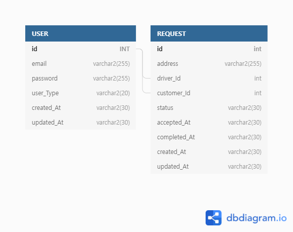

# 배달 REST api Server

# 프로젝트 설명

고객과 기사간의 배차 요청을 위한 REST api Server  

# 개발환경

Back-end : java / spring boot / aop / sonarLint / JPA

DB : H2

# 기술구현 내용

* RESTful api 서버

* 로그인 / 회원가입

* 배차 요청

* 배차 요청 승인

* 배차 요청 완료

* JPA를 이용한 DB 작업

* 테스트 코드 작성

  

# DB ERD

# 성과

* enum 사용을 통해 코드의 가독성을 높이고 enum을 사용 하지 않았을 시에 발생할 수 있는 오타로 인한 실수들을 줄일 수 있었다.
* responseEntity를 통해 httpStatus를 함께 전달 함으로써 받는 주체로 하여금 더 명확한 상태를 체크할 수 있게 구현하였다.
* JPA Repository를 사용하여 간결하고 빠르게 데이터베이스 작업을 할 수 있었다. 
* spring-aop를 통해서 인증과 같은 공통적으로 사용되는 부분들을 묶어서 처리할 수 있는 기능을 구현해 볼 수 있었다.
* SonarLint를 사용하여 코드의 가독성을 높일 수 있었고 그로 인하여 개발자들이 범용적으로 사용하는 코딩양식들을 익힐 수 있었다.
* H2 In memory DB를 사용하여 빠르게 세팅하여 데이터베이스 작업을 구현할 수 있었다.
* 테스트코드 작성을 통해서 직접적인 데이터를 입력받아야 하는 수고를 덜 수 있었다.
